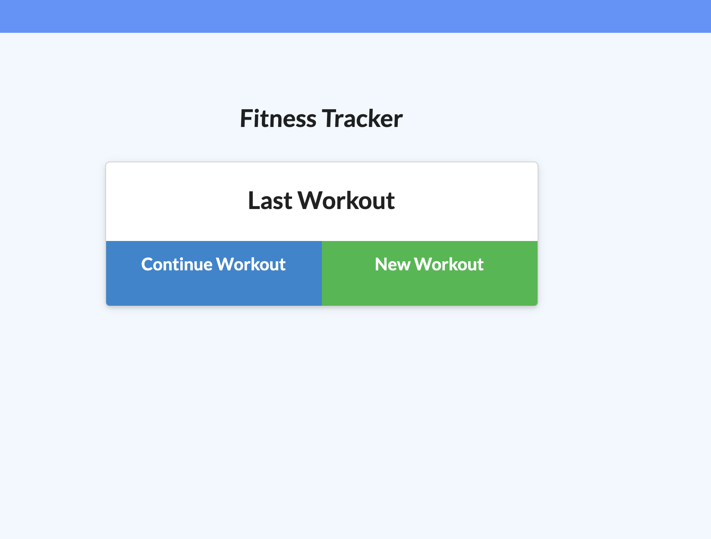

 # Workout Tracker

  ## Short Description
  ### This app let users to daily workout and able track the name, type, weight, sets, reps, and duration of exercise.
  ## Table of Contents:
- [Installation](#Installation)
- [Usage](#Usage)
- [Licenses](#Licenses)
- [Contributing](#Contributing)
- [Test](#Test)
- [Questions](#Questions)

## Installation
To install necessary dependencies run the following command:
  npm i
## Test:
  To run tests, run the following command:
  N/A

## Usage:
  
## Licenses
**These are the licenses needed for this project.**  

## Contributing:
  

## Questions:
Contact Me: mikebannoura@gmail.com 
GitHub Username: Bannoura9 
Github profile picture: 

Deployed app link: 
https://pure-waters-20055.herokuapp.com

GitHub repo:
https://github.com/bannoura9/Workout-tracker

  
  

